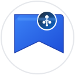

# BookMarkHub

<div align="center">
  
  <br>
  <strong>A browser bookmark manager optimized for capture and retrieval speed</strong>
</div>

## ✨ Features

- **🚀 One-click save** - Extract page title and URL into structured bookmark entries
- **🐙 GitHub integration** - Save bookmarks as GitHub issues in your repository  
- **🔍 Powerful search** - Use GitHub's advanced search and filtering capabilities
- **📝 Rich descriptions** - Add notes and context to your bookmarks
- **🏷️ Smart organization** - Leverage GitHub labels for categorization
- **⚡ Fast retrieval** - Find bookmarks instantly with GitHub's search

## 📸 Screenshots

<div align="center">
  
  <br>
  <em>Clean, intuitive interface for quick bookmark management</em>
</div>

## 🚀 Get Started

### 📦 Installation

#### Option 1: Build from Source
1. Clone this repository
2. Install dependencies: `pnpm install`
3. Build the extension: `pnpm build` (Chrome) or `pnpm build:firefox` (Firefox)
4. Load the extension in your browser:
   - **Chrome/Edge**: Load from `./output/chrome-mv3-prod`
   - **Firefox**: Load from `./output/firefox-mv2-prod`

#### Option 2: Development Mode
- Chrome: `pnpm dev` then load `./output/chrome-mv3-dev`
- Firefox: `pnpm dev:firefox` then load `./output/firefox-mv2-dev`

### ⚙️ Setup GitHub Connection

1. **First Launch**: Click the extension icon in your browser toolbar
2. **GitHub Setup**: In the options page, provide:
   - Your GitHub username
   - Repository name for storing bookmarks (create one if needed)
   - [Personal access token](https://github.com/settings/personal-access-tokens/new) with `Issues` permission
3. **Connect**: Click "Connect" and verify the success message
4. **Start Bookmarking**: Navigate to any page and click the extension icon to save

> 💡 **Tip**: Your repository can be public or private - the extension works with both!

## ❓ FAQ

<details>
<summary><strong>How to set up keyboard shortcuts?</strong></summary>

You can assign a custom keyboard shortcut to quickly open the extension:
- **Chrome/Edge**: Go to `chrome://extensions/shortcuts`
- **Firefox**: Visit `about:addons` → Extension settings → Shortcuts

</details>

<details>
<summary><strong>How are bookmarks organized?</strong></summary>

Each bookmark becomes a GitHub issue with:
- **Title**: The webpage title
- **Body**: The URL
- **Comments**: Your additional notes and descriptions  
- **Labels**: Tags for categorization (future feature)

This gives you access to GitHub's powerful search, filtering, and organization tools!

</details>

<details>
<summary><strong>Can I use a private repository?</strong></summary>

Yes! BookmarkHub works with both public and private repositories. Your bookmarks will only be visible to you and anyone with repository access.

</details>

<details>
<summary><strong>What permissions does the token need?</strong></summary>

Your GitHub personal access token needs:
- **Issues**: Read and write access to create and manage bookmark issues
- **Repository access**: Select the specific repository for your bookmarks

</details>

## 🛠️ Development

### Tech Stack

- **[WXT](https://wxt.dev/)** - Modern browser extension framework
- **[React 19](https://react.dev/)** - UI framework with TypeScript
- **[TailwindCSS](https://tailwindcss.com/)** - Utility-first CSS framework  
- **[shadcn/ui](https://ui.shadcn.com/)** - Beautiful, accessible components
- **[Octokit](https://github.com/octokit/octokit.js)** - GitHub API integration

### Development Commands

```bash
# Install dependencies
pnpm install

# Development
pnpm dev              # Chrome development build
pnpm dev:firefox      # Firefox development build

# Production builds
pnpm build            # Chrome production build
pnpm build:firefox    # Firefox production build

# Packaging
pnpm zip              # Package Chrome extension
pnpm zip:firefox      # Package Firefox extension

# Type checking
pnpm compile          # TypeScript compilation check
```

### Adding Components

```bash
# Add new shadcn/ui components
pnpm dlx shadcn@latest add tooltip
pnpm dlx shadcn@latest add dialog
```

### Project Structure

```
src/
├── components/ui/     # Reusable UI components
├── entrypoints/       # Extension entry points
│   ├── background.ts  # Background script
│   ├── popup/         # Extension popup
│   └── options/       # Settings page
└── lib/              # Utilities and helpers
```

---

<div align="center">
  <strong>Built with ❤️ for better bookmark management</strong>
  <br><br>
  <a href="https://github.com/st01cs/bookmarkhub/issues">🐛 Report Bug</a> • 
  <a href="https://github.com/st01cs/bookmarkhub/issues">✨ Request Feature</a>
</div>
